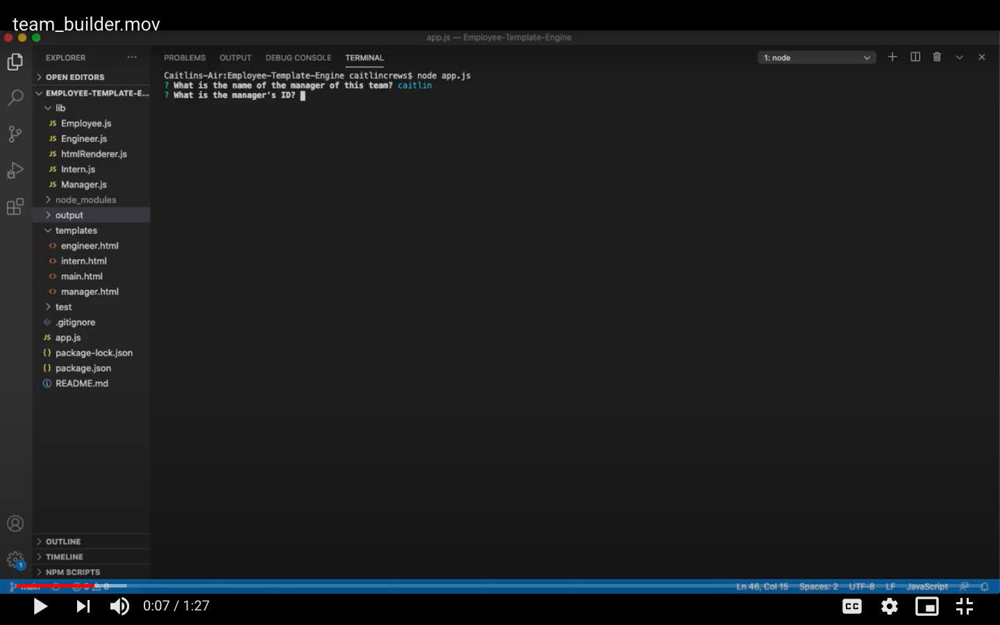

  # Employee Template Engine

  ## Description
  This website was developed as part of my week 10 homework assignment for the Coding Bootcamp at the University of Central Florida.

  This program consists of a Node CLI that takes in information about employees and generates an HTML webpage that displays summaries for each person.


  ## Table of Contents
  * [Installation](#installation)
  * [Usage](#usage)
  * [Contributing](#contributing)
  * [Questions](#questions)
  
  
  ## Installation
  This program requires Node.js, Inquirer.js, and Jest. To install necessary dependencies, run the following command:

  ```
  npm i
  ```

  
  ## Usage
  When the user runs `node app.js` in the terminal, they are prompted with questions concerning the manager of the team. 
  
  When all prompts concerning the manager have been answered, the user is asked if they would like to add additional members of the team. The user can add an engineer or intern and answer all relevent questions.
  
  Once the user has signified that they are finished adding team members, a `team.html` file is generated in the `output` folder.

  <br>
  See example demonstration here:

  [](https://drive.google.com/file/d/1yFYU7pptK8jV7ZsQMH1mY_vyWoRofpUj/view?usp=sharing)

  ## Contributing
  To contribute to this repo, feel free to make a pull request and I'll look it over. Thanks! :)

  
  ## Questions
  Have any questions for me? Contact me here:

  Github: [@caitlincrews08](https://github.com/caitlincrews08)

  Email: caitlinrcrews@gmail.com